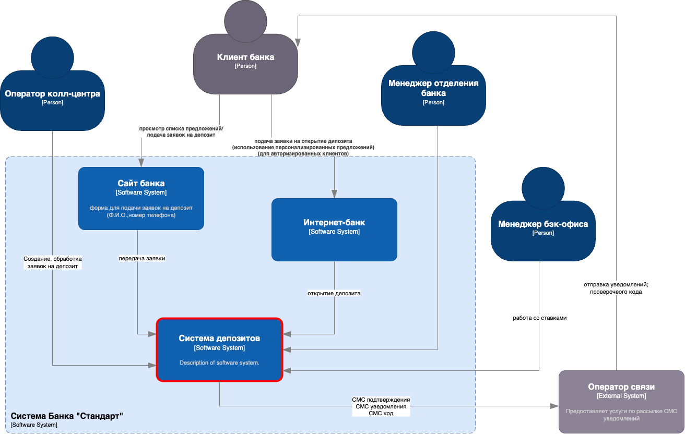
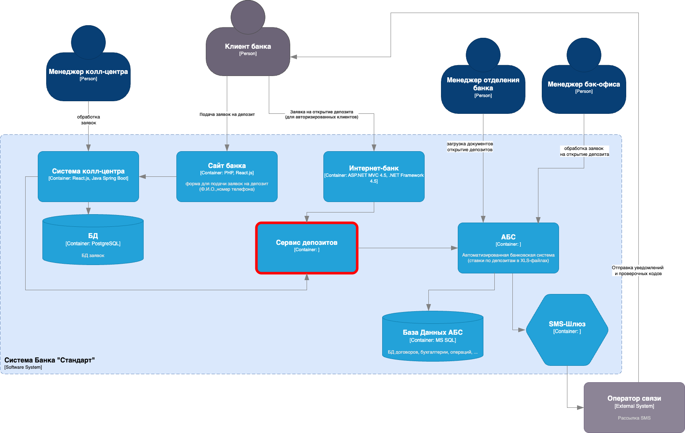

### Название задачи:
Концептуальная архитектура открытия депозитов для MVP

### Автор:
- Команда цифровой трансформации розничного бизнеса
- IT-отдел

### Дата:
2025-06-09

### Функциональные требования

| № | Действующие лица/системы | Use Case | Описание |
|---|---|---|---|
| 1 | Клиент, Сайт | Подача заявки на депозит | Клиент оставляет ФИО и номер телефона. Заявка передается в колл-центр. |
| 2 | Колл-центр, Клиент | Обработка заявки | Менеджер изучает заявку, звонит клиенту и может предложить особые условия. |
| 3 | Новый клиент, Отделение | Идентификация | Клиент проходит очную идентификацию в отделении с документами. |
| 4 | Авторизованный клиент, Интернет-банк | Открытие депозита | Клиент видит персонализированные ставки, выбирает продукт и сумму, подтверждает операцию по СМС. |
| 5 | Менеджер бэк-офиса | Подтверждение условий | Менеджер проверяет и подтверждает заявку в АБС. |
| 6 | Бэк-офис | Управление ставками | Сотрудники обновляют ставки в XLS или централизованной системе. |

### Нефункциональные требования

| № | Требование |
|---|---|
| 1 | Защита трафика (HTTPS, шифрование) для сайта и Интернет-банк |
| 2 | Доступность 99.9%, работа 24/7, использование резервного ЦОД |
| 3 | Быстрый отклик интерфейсов (<1 секунды) |
| 4 | Использование текущих технологий: MS SQL, Oracle (Kafka в перспективе) |
| 5 | Минимизация нагрузки на АБС, запрет прямого доступа из Интернет-банк |
| 6 | Масштабируемость: горизонтальное для Интернет-банк, вертикальное для АБС |
| 7 | Совместимость с существующими платформами и внутренней экспертизой |
| 8 | Разработка документации для будущего расширения системы |

### Решение

**Диаграмма контекста:**

**Диаграмма контейнеров:**

**Принятые решения:**
- Исключение прямой нагрузки на АБС из Интернет-банк
- Подготовка к миграции Интернет-банк на микросервисы через выделенный сервис заявок
- Независимое развертывание и масштабирование сервисов в разных ЦОД
- Использование текущих технологий для снижения затрат и рисков

### Альтернативы

- **Прямая интеграция Интернет-банк с АБС:** Отклонена из-за рисков перегрузки и недоступности
- **Внешний СМС-сервис:** Отклонен из-за затрат и потери контроля
- **Хранение ставок в Excel:** Текущее решение, но планируется переход на централизованный сервис

### Ограничения и риски

- Ручная обработка заявок снижает уровень автоматизации в MVP
- Требуется обеспечение защиты персональных данных при передаче
- Возможны задержки из-за ручных операций
- Текущая несовместимость Интернет-банка с Kafka ограничивает использование очередей
- Риски недоступности при неготовности резервного ЦОД
- Потенциальные проблемы производительности при росте числа клиентов