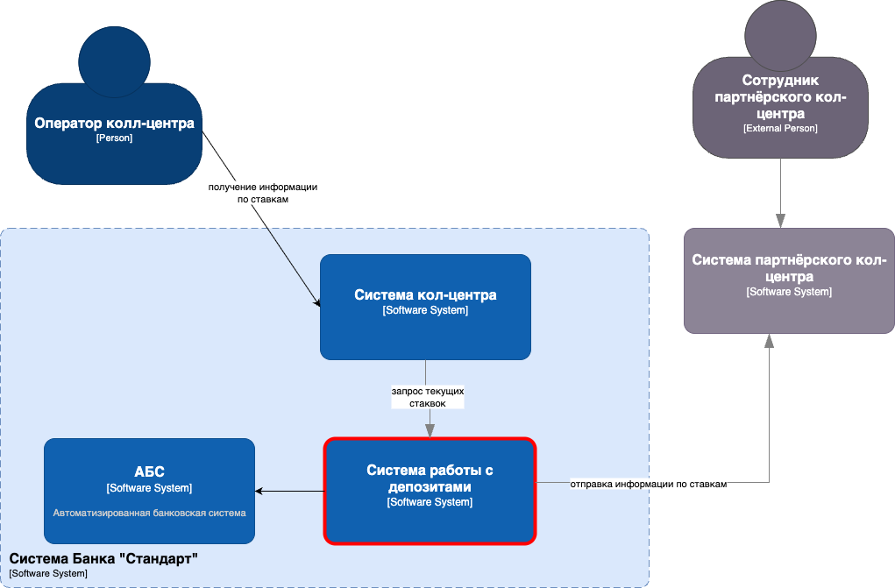
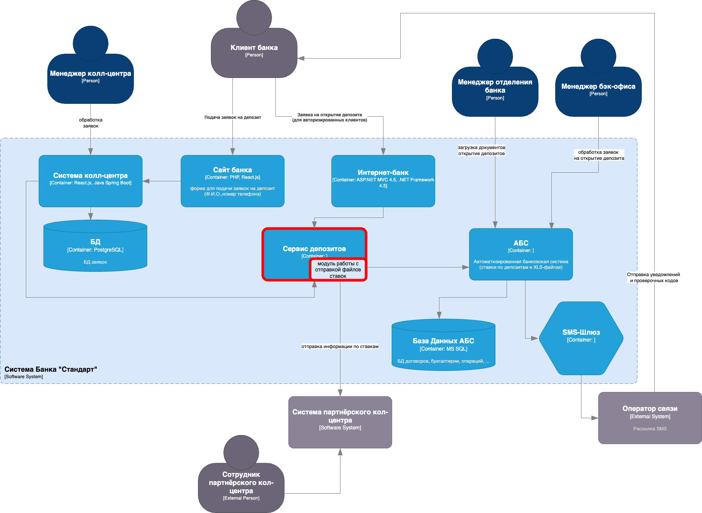

### Название задачи:
Расширение архитектуры MVP для интеграции колл-центров (внутреннего и партнерского) с системой ставок

### Автор:
Команда цифровой трансформации

### Дата:
2025-06-09

### Функциональные требования

| № | Действующие лица/системы | Use Case | Описание |
|---|---|---|---|
| 1 | Сотрудник колл-центра | Консультация по ставкам | Получение актуальных ставок по депозитам через интерфейс системы колл-центра в реальном времени |
| 2 | Партнерский колл-центр | Получение обновлений ставок | Регулярное получение файла с актуальными ставками для консультации клиентов |
| 3 | Сервис управления ставками | Экспорт ставок | Автоматическая генерация и выгрузка файла с ставками для партнерского колл-центра |
| 4 | Администратор | Управление экспортом ставок | Настройка периодичности и параметров выгрузки файла для партнера |

### Нефункциональные требования

| № | Требование |
|---|---|
| 1 | Реальный доступ к ставкам для внутреннего колл-центра |
| 2 | Ежедневное обновление ставок для партнерского колл-центра |
| 3 | Простой формат файла (CSV/XLSX) для легкой обработки партнером |
| 4 | Защита данных при экспорте: шифрование, контроль доступа, безопасная передача |
| 5 | Использование файлового обмена (без API) для партнерского колл-центра |
| 6 | Минимизация нагрузки на основные системы банка |

### Решение

**Диаграмма контекста:**

**Диаграмма контейнеров:**

**Обоснование решений:**
- Использование существующего сервиса управления ставками для минимизации изменений
- Реализация read-only доступа для внутреннего колл-центра через API
- Файловый обмен с партнерским колл-центром через защищенные каналы
- Автоматизация выгрузки через планировщик заданий (cron/Task Scheduler)
- Поддержка форматов CSV/XLSX для простоты интеграции
- Использование существующих технологий банка (.NET/Java, MS SQL/Oracle)

### Альтернативы

- **Прямой API-доступ для партнера:** Невозможен due to технические ограничения партнера
- **Создание отдельной БД для партнера:** Избыточно и сложно в поддержке
- **Ручная отправка файлов:** Не масштабируемо и подвержено ошибкам

### Ограничения и риски

- Задержки в актуализации данных у партнера (до 24 часов)
- Необходимость ручного контроля актуальности выгружаемых данных
- Риски безопасности при передаче файлов требуют дополнительных мер защиты
- Отсутствие реального времени данных у партнерского колл-центра
- Зависимость от надежности файлового обмена